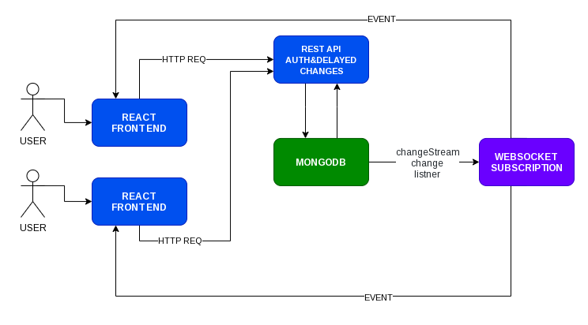

    <h1> LMS Conversations Backend 🎯</h1>
    

        <b>A chat application built under sub-project LMS</b>
    

    
    
    

### TechStack

- [NodeJS](https://nodejs.org/en/)- Executes JavaScript code outside of a browser.
- [ExpressJS](http://expressjs.com/)- Express is a minimal and flexible Node.js web application framework.
- [MongooseJS](https://mongoosejs.com/)- Elegant mongodb object modeling for NodeJS.
- [Socket.io](https://socket.io/)- Socket.IO enables real-time, bidirectional and event-based communication.
- [ExpressJWT](https://www.npmjs.com/package/express-jwt)- Provides Express middleware for validating JWTs (JSON Web Tokens) through the jsonwebtoken module.
- [jsonwebtoken](https://www.npmjs.com/package/jsonwebtoken)- An implementation of JSON Web Tokens.

### Database
- [MongoDB](https://www.mongodb.com/) - The database for modern applications.

### Chat Architecture

